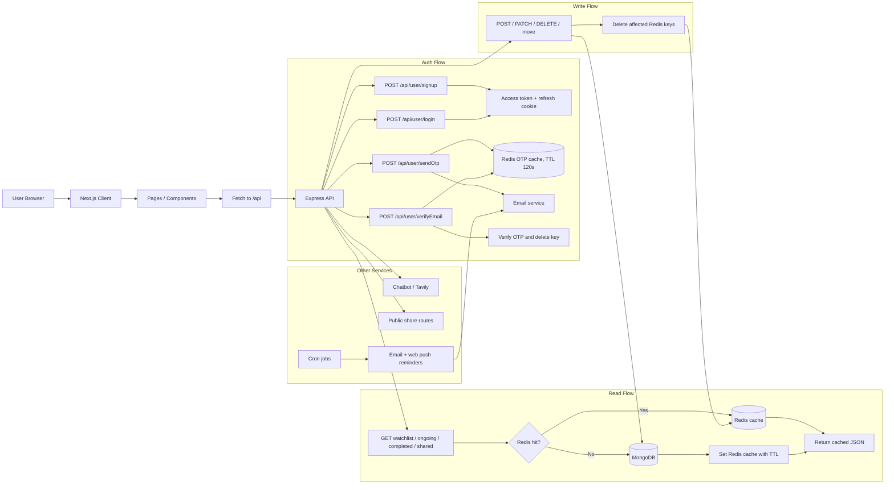

<div align="center">

# 🎬 CineQueue

**Your AI-Powered Tracker Cum Organizer**

</div>
</br>
CineQueue is a full-stack web application with LLM-powered semantic search (via Tavily) to track shows/movies across three personal states with Features:

- watchlist
- ongoing
- completed (folder-based)
- link sharing (share folders/lists via unique public links)
- scheduled automated reminder in form of emails and web-push notifications
- chatbot (for searching about movies/series/animes information, getting recommendations, etc)

## Why CineQueue

CineQueue exists to keep a user's watch history, current progress, and future picks in one place instead of spreading them across notes, bookmarks, and streaming apps.

- It gives a single workflow for tracking watchlist, ongoing, and completed items.
- It makes sharing curated lists and folders simple with unique public links.
- It helps users discover what to watch next with chatbot-based search and recommendations.
- It keeps the experience fast with Redis-backed reads and clean data updates in MongoDB.

## Architecture Visualizer



Backend behavior in plain terms:

- GET requests for watchlist, ongoing, completed, and shared views check Redis first, then fall back to MongoDB on cache miss.
- POST, PATCH, DELETE, and move actions write to MongoDB first and then clear the relevant Redis keys so the next GET rebuilds the cache.
- Login and signup issue JWT access tokens plus an HTTP-only refresh cookie.
- Chatbot requests go through the backend and use Tavily, while reminder jobs run from cron and trigger mail / web-push notifications.

The project is split into:

- `client/`: Next.js frontend (deployed on Vercel)
- `backend/`: Express + MongoDB + Redis API + Tavily Search (LLM-powered search) (deployed on Render as a plain Node web service)

## Quick Links

- Backend detailed documentation: [Backend README](backend/readme.md)

## Project Structure

```text
CineQueue/
	client/
		app/
		components/
		lib/
	backend/
		controllers/
		cron/
		middlewares/
		models/
		routes/
		services/
```

## Local Development

### Frontend

```bash
cd client
npm install
npm run dev
```

### Backend

```bash
cd backend
npm install
npm run dev
```

## Tech Stack

**Frontend:** `Next.js 15` • `React 19` • `TypeScript` • `Tailwind CSS 4` • `lucide-react` • `clsx` • `tailwind-merge`

**Backend:** `Node.js` • `Express 5` • `MongoDB` • `Mongoose` • `Redis` • `JWT` • `bcrypt` • `cookie-parser` • `cors` • `node-cron` • `Resend` • `Tavily Core`

**Dev / Tooling:** `Nodemon` • `ESLint` • `Turbopack` • `dotenv`

## Deployment Overview

| Piece    | Platform | How                                                    |
| -------- | -------- | ------------------------------------------------------- |
| Frontend | Vercel   | Connect the repo, set root directory to `client/`, deploy |
| Backend  | Render   | Connect the repo as a **Web Service**, root directory `backend/`, build command `npm install`, start command `npm start` (see `render.yaml`) |
| Database | MongoDB Atlas | Free-tier cluster, paste connection string into `MONGO_URI` |
| Cache    | Redis Cloud / Upstash | Free-tier instance, paste host/port/password into the Redis env vars |

No containers, no CI/CD pipeline, no cloud VM required — both services deploy straight from GitHub pushes.

### Deploying the backend to Render

1. Push this repo to your own GitHub account.
2. On [Render](https://render.com), click **New → Web Service**, connect your repo.
3. Render will auto-detect the `render.yaml` blueprint (root `backend/`, `npm install` / `npm start`). If not, set those fields manually.
4. Add the environment variables listed in [`backend/readme.md`](backend/readme.md) in the Render dashboard (Mongo URI, JWT secrets, Redis credentials, Resend token, `client_url`).
5. Deploy — Render gives you a live HTTPS URL for the API.

### Deploying the frontend to Vercel

1. Import the repo into [Vercel](https://vercel.com).
2. Set the project root to `client/`.
3. Add an env var pointing the frontend at your Render API URL (see `client/lib` for the expected variable name).
4. Deploy.

## Notes

- Keep all sensitive values in environment variables.
- Do not commit `.env` files to the repository.
- For backend endpoint details and env keys, see [Backend README](backend/readme.md).
- Browser cookies: If your browser blocks third-party cookies, the HTTP-only refresh cookie may not be sent during cross-origin token refresh. This can cause frequent logouts or 400 errors for missing refresh token. Allow third-party cookies for the site (or set cookie SameSite=None and secure) to remain logged in longer.
- CORS & runtime caution: Be careful when configuring CORS and cross-origin behavior — incorrect settings can cause abnormal client/server behavior in production. Also pin and verify package versions carefully; mismatched or deprecated libraries (CommonJS vs ESM differences) can cause runtime failures. Pin dependencies and test in a staging environment before production.
